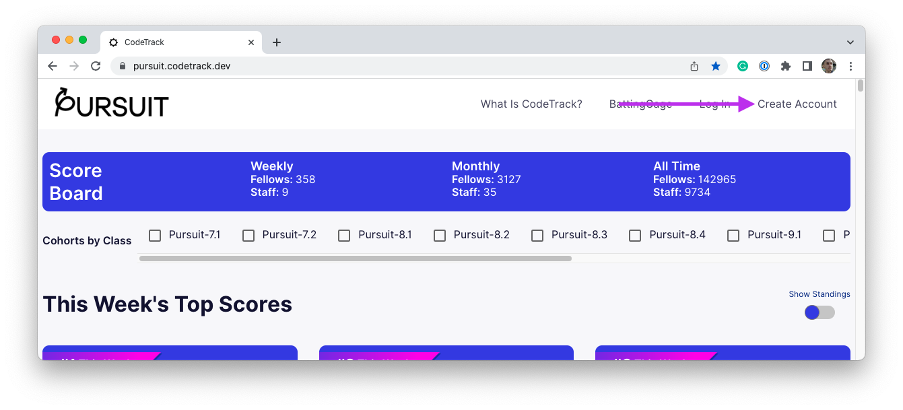
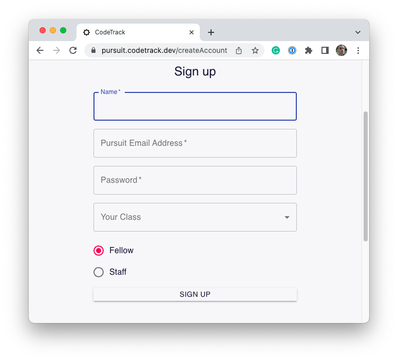
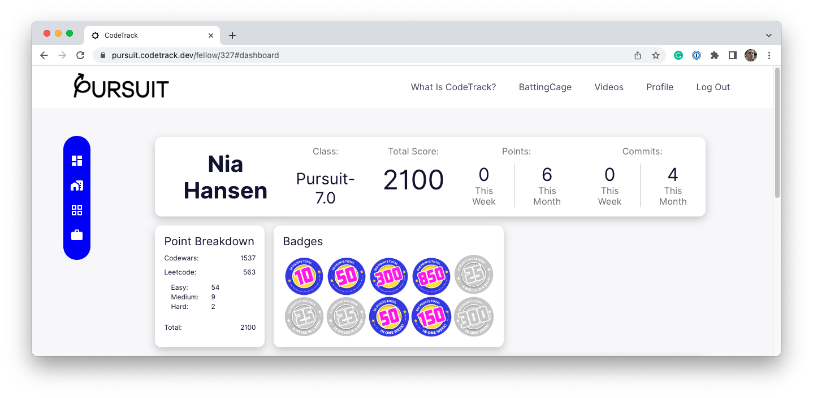
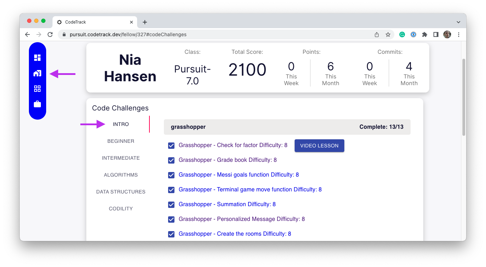
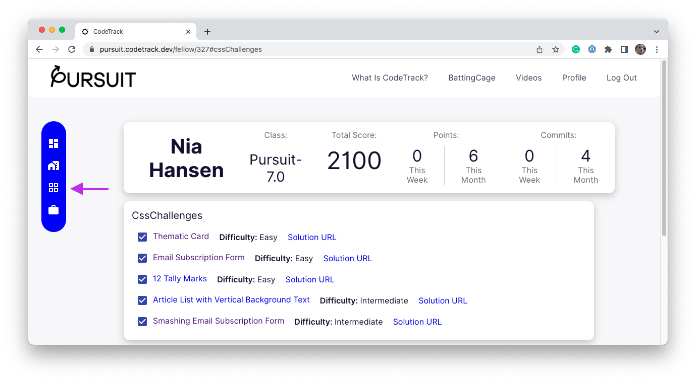

# CodeTrack

At its core, learning to Code is about learning how to solve problems, not just make websites. It's critical throughout this course for you to continue building your fundamental problem-solving skills. At Pursuit, you will be encouraged to engage with all kinds of websites that provide technical challenges. The most important of these tools is [CodeTrack](https://pursuit.codetrack.dev/).

CodeTrack allows any developer to build a profile that represents their work, their skill and the type of work they are most interested in doing professionally. Your CodeTrack profile is a compilation of work you do across several platforms like Github, Leetcode, and Codewars.

This guide will show you how to create an account on CodeTrack and get started with it.

## Sign up

To sign up for a CodeTrack account, visit [pursuit.codetrack.dev](https://pursuit.codetrack.dev/). Then, click the "Create Account" link.

Complete the sign-up form as required. Make sure you provide the same name you provided to Pursuit and use your Pursuit email address. Then, click Sign Up.

## Connect accounts

CodeTrack can connect your Codewars, Leetcode, and GitHub accounts. As you work on these sites, CodeTrack will aggregate all of your scores into one place.

To find out how to do so, visit the [How to Use](https://pursuit.codetrack.dev/howToUse) page on CodeTrack. Follow the instructions there to learn how to connect your accounts.

## Complete code challenges

Once you've connected your accounts, your work on these various sites will be tracked in one place. CodeTrack can also suggest certain challenges to you.

To begin working on CodeTrack suggested code challenges, visit your Profile page. On that page, you will see a breakdown of your current work.

Next, click on the second icon in the menu bar to the left. This will bring you to the "Code Challenges" page.

After clicking, you should see a list of challenges in the middle of the screen. These links will bring you directly to a code challenge on another website. It is suggested that you begin working on challenges in "Intro" before moving ahead.

When challenges are completed, they will eventually be synced with CodeTrack. In the image above, this Fellow has completed all of the tasks in the "grasshopper" track.

The third icon down will provide CSS challenges that you can complete.

The final icon will allow you to add GitHub projects. Those project commits will be tracked by CodeTrack.

## How CodeTrack will be used

At different points in the course, you will be required to complete challenges on CodeTrack. This is to ensure that you are continuing your practice of solving code challenges, a needed skill for getting your first job in the industry.

You may also be required to add projects to CodeTrack. Your instructors will let you know how and when you must use CodeTrack to record your work.
