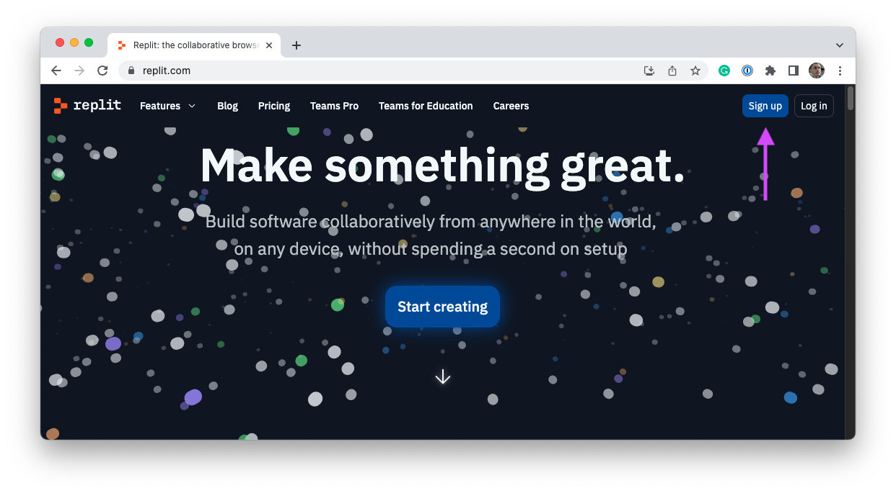
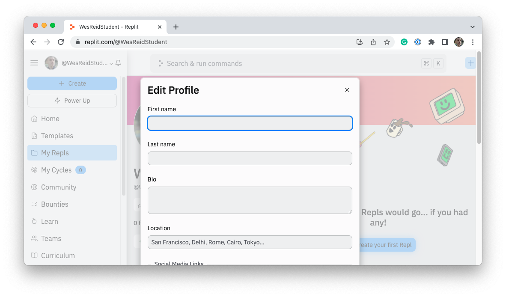
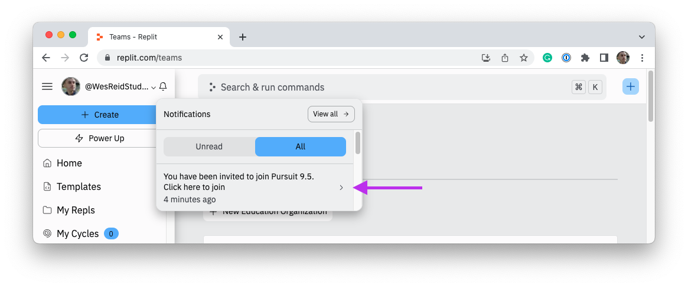
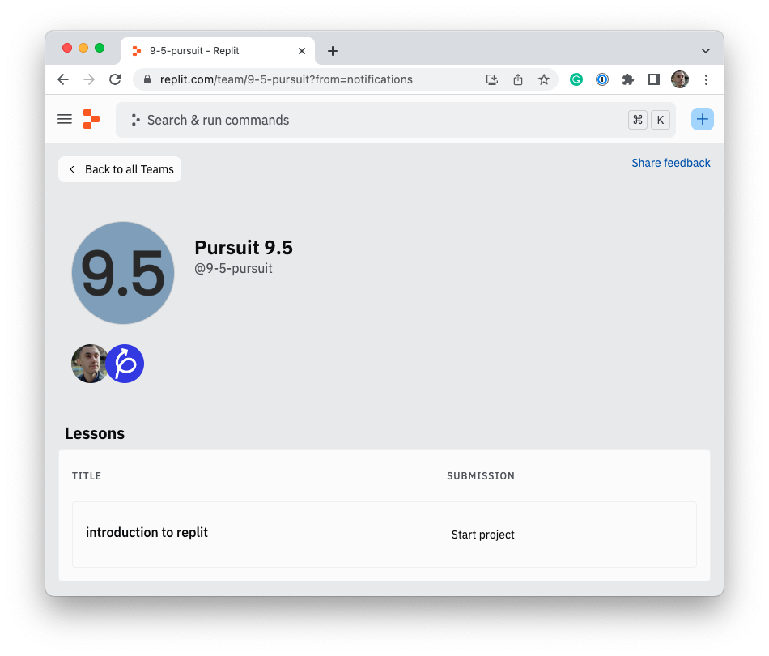

# Replit

Most developers write code locally on their machines. However, to do so, you are required to install a few tools and learn many new skills. Replit is an online integrated development environment or IDE. Replit will allow you to learn to code without needing to make changes to your computer.

## Sign up for Replit

First, you will need to sign up for Replit. To do so, click the **Sign up** button on the [Replit homepage](https://replit.com).

When prompted, create an account using your _Pursuit Google account._

After you've created an account, finish your account by visiting your profile page and clicking on **Edit**. Fill in at least your first and last name. You should also upload a professional photo of yourself to your account.

## Join your classroom's team

Each classroom at Pursuit has a Replit team. Your instructor will either invite you via email to your Replit team or will share out a link that will allow you to join. Depending on how you were invited, you may have an alert that will allow you to join your class team.

Once you've joined your classroom's team, you should see at least one assignment. Your instructor will lead you through the assignment.

